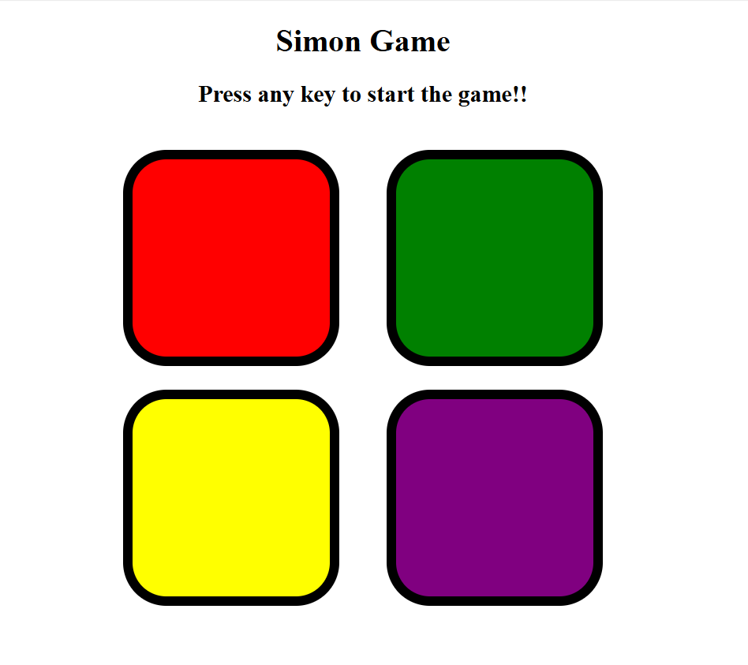
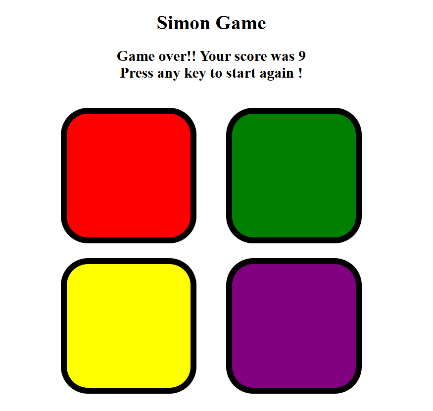

# 🎮 Simon Game

**Simon Game** is a fun and interactive memory game that challenges players to remember and repeat a growing sequence of colors and sounds. As the sequence increases, the difficulty ramps up, making it a fun test of memory and reflexes. The game is designed with simple yet engaging gameplay and is a great way to improve concentration and cognitive skills.

---

## 🚀 Technologies Used

- **Frontend**: HTML, CSS, JavaScript
  
---

## ⚡ Features

### 🎶 Game Sequence
- The game generates a random sequence of colors and sounds. Your task is to repeat the sequence.

### 🔄 Increasing Difficulty
- With each correct sequence, the game adds another step to the sequence, increasing the challenge.

### 💥 Error Handling
- If you make an error, the game will notify you and you’ll have to start over.

### 📊 Score Tracking
- Track your score based on how long you can continue without making an error.

### 🎯 User-Friendly Interface
- Easy to understand and use interface with responsive design to play on any device.

---

## 📸 Screenshots
 # At the Start of Simon Game

 # At the End of Simon Game

